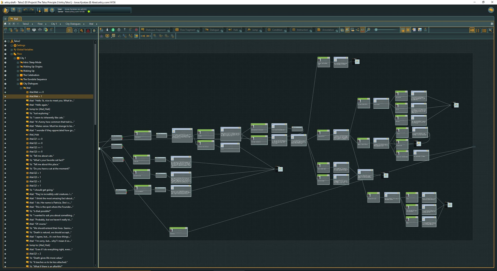

# Writing Your AVN

Once you've decided on your art medium, game engine, and general plot, then it's time to start writing. The writer of Race of Life wrote a great piece about writing AVNs in this [magazine issue](https://firebasestorage.googleapis.com/v0/b/avn-web.appspot.com/o/magazines%2F2-1.pdf?alt=media&token=95a694fc-a83c-478c-9b7f-5b419fd0c10e).

The writing is more than just the story, it's the dialogue, jokes, pacing, transitions between scenes, and all sorts of things you don't think that much about until you make a game. So try to avoid writing in a vacuum, but make sure that you're rendering after you write various segments of your story. It's easy to think something will be good, it's another to play your game and know whether it's good or not.

:::tip
Some developers render as they write each dialogue line. Others storyboard the entire arc before rendering anything. There's no best workflow, just go with whatever works best for you!
:::

A common misconception for many is the idea that writing is the easy part of creating a visual novel. But once people begin to write, they realize that the writing is just as difficult as the programming and the art. How and when to branch, whether to soft branch or hard branch, whether to use points, etc. The complexity ends up to the point where devs end up using tools like [Articy](https://www.articy.com/en/) or [Twine](https://twinery.org/) to storyboard their branching.

> 

If you're struggling to get started, suggest you write out anything and everything that's on your mind, no matter how terrible, and then go back and edit later. Getting something down is the hardest part! Once you get over that hurdle you'll find editing your mess of dialogue and story points so much easier.
